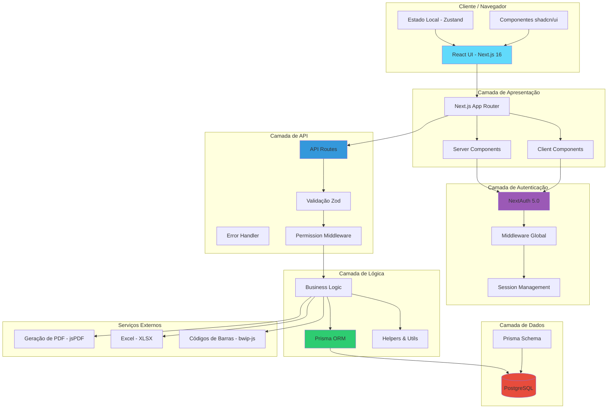
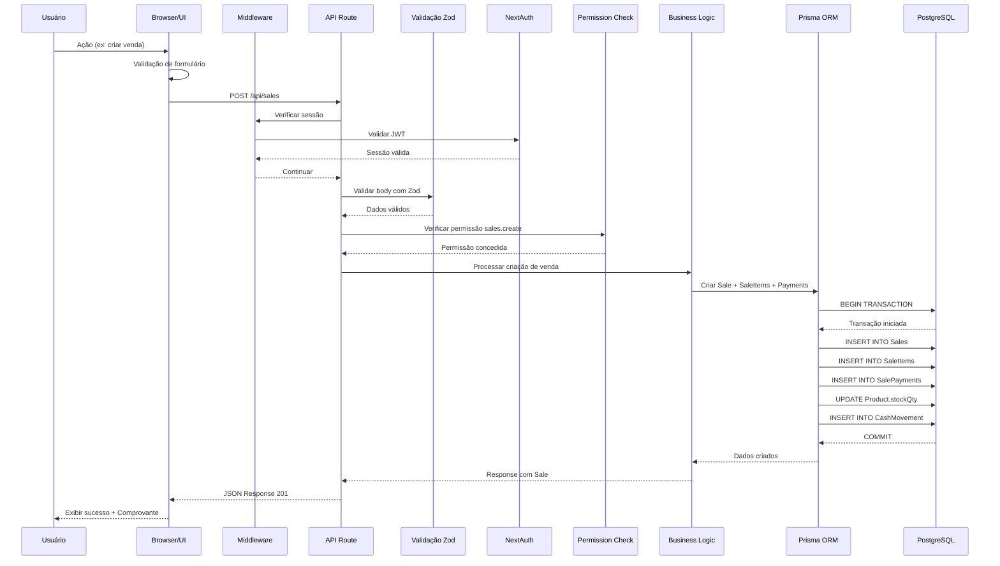
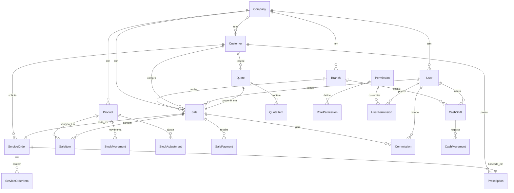
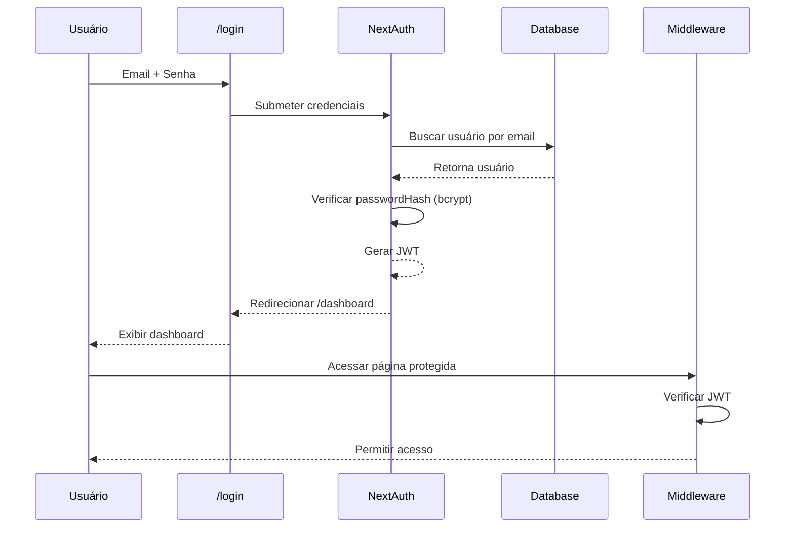

# 📘 DOCUMENTAÇÃO COMPLETA DO SISTEMA PDV ÓTICA

> **Versão:** 1.0.0
> **Data:** Fevereiro 2026
> **Autor:** Documentação Técnica Automatizada
> **Propósito:** Onboarding, Auditoria Técnica e Planejamento Estratégico

---

## 📑 ÍNDICE

1. [Visão Geral do Sistema](#parte-1-visão-geral-do-sistema)
2. [Arquitetura do Sistema](#parte-2-arquitetura-do-sistema)
3. [Banco de Dados](#parte-3-banco-de-dados)
4. [Módulos e Funcionalidades](#parte-4-módulos-e-funcionalidades)
5. [APIs do Sistema](#parte-5-apis-do-sistema)
6. [Interface do Usuário (UI/UX)](#parte-6-interface-do-usuário-uiux)
7. [Autenticação e Segurança](#parte-7-autenticação-e-segurança)
8. [Integrações e Dependências](#parte-8-integrações-e-dependências)
9. [Configurações e Ambiente](#parte-9-configurações-e-ambiente)
10. [Fluxos de Negócio](#parte-10-fluxos-de-negócio)
11. [Estatísticas do Código](#parte-11-estatísticas-do-código)
12. [Pontos de Melhoria](#parte-12-pontos-de-melhoria-identificados)
13. [Roadmap Sugerido](#parte-13-roadmap-sugerido)

---

# PARTE 1: VISÃO GERAL DO SISTEMA

## 1.1 Informações do Projeto

### Identificação
- **Nome do Sistema:** PDV Ótica
- **Versão Atual:** 1.0.0
- **Tipo:** Sistema de Ponto de Venda e Gestão Empresarial
- **Domínio:** Varejo Óptico
- **Licença:** Proprietária

### Stack Tecnológico Completo

#### Frontend
- **Framework:** Next.js 16.1.6 (App Router)
- **Biblioteca UI:** React 19.2.4
- **Linguagem:** TypeScript 5.9.3
- **Estilização:** Tailwind CSS 3.3.0
- **Componentes UI:** shadcn/ui (Radix UI)
- **Ícones:** Lucide React 0.563.0
- **Gráficos:** Recharts 3.7.0
- **Formulários:** React Hook Form 7.71.1
- **Validação:** Zod 4.3.6
- **Gerenciamento de Estado:** Zustand 5.0.11
- **Notificações:** React Hot Toast 2.6.0 + Sonner 2.0.7

#### Backend
- **Runtime:** Node.js
- **Framework:** Next.js API Routes
- **ORM:** Prisma 5.22.0
- **Banco de Dados:** PostgreSQL (via Supabase/Vercel)
- **Autenticação:** NextAuth 5.0.0-beta.30

#### Bibliotecas Especializadas
- **Geração de PDFs:** jsPDF 4.1.0 + jsPDF-AutoTable 5.0.7
- **Excel:** XLSX 0.18.5
- **QR Code:** qrcode 1.5.4
- **Código de Barras:** bwip-js 4.8.0
- **Datas:** date-fns 4.1.0
- **Criptografia:** bcryptjs 3.0.3

#### DevOps e Ferramentas
- **Linter:** ESLint 9.39.2
- **Bundler:** Turbopack (Next.js 16+)
- **Package Manager:** npm
- **Hospedagem:** Vercel (implícito)
- **Banco de Dados:** Supabase/Vercel Postgres

### Estrutura de Pastas do Projeto

```
PDV OTICA/
│
├── prisma/
│   ├── schema.prisma          # Schema do banco (55 models, 28 enums)
│   ├── seed.ts                # Seed inicial do banco
│   └── seed-mock.ts           # Seed com dados de teste
│
├── src/
│   ├── app/                   # Next.js App Router
│   │   ├── (auth)/
│   │   │   └── login/         # Página de login
│   │   │
│   │   ├── (dashboard)/       # Layout principal autenticado
│   │   │   ├── layout.tsx     # Layout com Sidebar + Header
│   │   │   └── dashboard/     # Todas as páginas do sistema
│   │   │       ├── page.tsx                    # Dashboard principal
│   │   │       ├── pdv/                        # Ponto de Venda
│   │   │       ├── vendas/                     # Gestão de vendas
│   │   │       ├── orcamentos/                 # Orçamentos
│   │   │       ├── ordens-servico/             # Ordens de Serviço
│   │   │       ├── clientes/                   # Cadastro de clientes
│   │   │       ├── produtos/                   # Cadastro de produtos
│   │   │       ├── fornecedores/               # Fornecedores
│   │   │       ├── funcionarios/               # Usuários do sistema
│   │   │       ├── estoque/                    # Gestão de estoque
│   │   │       ├── caixa/                      # Gestão de caixa
│   │   │       ├── financeiro/                 # Contas a pagar/receber
│   │   │       ├── metas/                      # Metas de vendas
│   │   │       ├── relatorios/                 # Relatórios gerenciais
│   │   │       └── configuracoes/              # Configurações do sistema
│   │   │
│   │   ├── api/               # API Routes do Next.js (73 endpoints)
│   │   │   ├── auth/          # Autenticação (NextAuth)
│   │   │   ├── customers/     # CRUD Clientes + Import/Export
│   │   │   ├── products/      # CRUD Produtos + Códigos de Barras
│   │   │   ├── sales/         # CRUD Vendas
│   │   │   ├── quotes/        # CRUD Orçamentos + Conversão
│   │   │   ├── service-orders/ # CRUD Ordens de Serviço
│   │   │   ├── suppliers/     # CRUD Fornecedores
│   │   │   ├── users/         # CRUD Usuários + Permissões
│   │   │   ├── cash/          # Operações de Caixa
│   │   │   ├── stock-movements/ # Movimentações de Estoque
│   │   │   ├── stock-adjustments/ # Ajustes de Estoque
│   │   │   ├── accounts-payable/ # Contas a Pagar
│   │   │   ├── accounts-receivable/ # Contas a Receber
│   │   │   ├── permissions/   # Permissões granulares
│   │   │   ├── dashboard/     # Métricas do dashboard
│   │   │   ├── reports/       # Relatórios diversos
│   │   │   ├── goals/         # Metas de vendas
│   │   │   ├── settings/      # Configurações (SystemRules)
│   │   │   ├── barcodes/      # Geração de códigos de barras
│   │   │   └── branches/      # Filiais
│   │   │
│   │   ├── layout.tsx         # Root layout
│   │   └── force-logout/      # Página de logout forçado
│   │
│   ├── components/            # Componentes React (67 arquivos)
│   │   ├── ui/                # Componentes base (shadcn/ui)
│   │   │   ├── button.tsx
│   │   │   ├── card.tsx
│   │   │   ├── dialog.tsx
│   │   │   ├── table.tsx
│   │   │   ├── form.tsx
│   │   │   ├── input.tsx
│   │   │   ├── select.tsx
│   │   │   └── ... (20+ componentes)
│   │   │
│   │   ├── layout/            # Componentes de layout
│   │   │   ├── sidebar.tsx    # Menu lateral
│   │   │   └── header.tsx     # Cabeçalho com perfil
│   │   │
│   │   ├── auth/              # Componentes de autenticação
│   │   │   ├── ProtectedRoute.tsx
│   │   │   └── ProtectedAction.tsx
│   │   │
│   │   ├── shared/            # Componentes compartilhados
│   │   │   ├── can.tsx
│   │   │   ├── search-bar.tsx
│   │   │   ├── empty-state.tsx
│   │   │   └── pagination.tsx
│   │   │
│   │   ├── pdv/               # Componentes específicos do PDV
│   │   ├── caixa/             # Componentes de caixa
│   │   ├── estoque/           # Componentes de estoque
│   │   ├── reports/           # Componentes de relatórios
│   │   ├── quotes/            # Componentes de orçamentos
│   │   ├── produtos/          # Componentes de produtos
│   │   ├── clientes/          # Componentes de clientes
│   │   ├── configuracoes/     # Componentes de configurações
│   │   ├── permission-guard.tsx
│   │   ├── page-permission-guard.tsx
│   │   └── supplier-select.tsx
│   │
│   ├── lib/                   # Utilitários e configurações
│   │   ├── prisma.ts          # Cliente Prisma singleton
│   │   ├── utils.ts           # Funções utilitárias (cn, formatCurrency)
│   │   ├── permissions.ts     # Sistema de permissões por cargo
│   │   ├── auth-permissions.ts # Helpers de autenticação
│   │   ├── auth-helpers.ts
│   │   ├── api-response.ts    # Padrões de resposta API
│   │   ├── error-handler.ts   # Tratamento de erros
│   │   ├── excel-utils.ts     # Funções para Excel
│   │   └── validations/       # Schemas Zod de validação
│   │       ├── customer.schema.ts
│   │       ├── product.schema.ts
│   │       ├── sale.schema.ts
│   │       ├── quote.schema.ts
│   │       ├── service-order.schema.ts
│   │       ├── user.schema.ts
│   │       ├── supplier.schema.ts
│   │       ├── stock-movement.schema.ts
│   │       ├── stock-adjustment.schema.ts
│   │       ├── cash.schema.ts
│   │       ├── barcode.schema.ts
│   │       └── system-rule.schema.ts
│   │
│   ├── middleware/            # Middlewares customizados
│   │   └── require-permission.ts
│   │
│   ├── middleware.ts          # Middleware global (NextAuth)
│   ├── auth.ts                # Configuração NextAuth
│   └── types/                 # Tipos TypeScript customizados
│       └── next-auth.d.ts     # Extensão de tipos do NextAuth
│
├── scripts/                   # Scripts utilitários
│   ├── test-evidencias.ts     # Script de testes
│   ├── validate-lucide-imports.ts
│   └── fix-lucide-imports.ts
│
├── public/                    # Arquivos estáticos
│
├── .env                       # Variáveis de ambiente
├── .env.local                 # Variáveis locais (gitignored)
├── package.json               # Dependências
├── tsconfig.json              # Configuração TypeScript
├── tailwind.config.js         # Configuração Tailwind
├── next.config.js             # Configuração Next.js
├── postcss.config.js          # Configuração PostCSS
└── README.md                  # Documentação básica
```

---

## 1.2 Propósito e Escopo

### O que o Sistema Faz (Resumo Executivo)

O **PDV Ótica** é um sistema de gestão empresarial completo desenvolvido especificamente para o segmento óptico. Ele unifica em uma única plataforma todas as operações necessárias para gerenciar uma ótica moderna, desde o ponto de venda até relatórios gerenciais avançados.

**Principais Capacidades:**
- ✅ Ponto de Venda (PDV) rápido e intuitivo
- ✅ Gestão completa de clientes com histórico de compras e receitas
- ✅ Catálogo de produtos especializado (armações, lentes, acessórios)
- ✅ Controle de estoque inteligente com alertas
- ✅ Ordens de Serviço para montagem de óculos
- ✅ Orçamentos com conversão para venda
- ✅ Gestão de caixa com turnos e movimentações
- ✅ Financeiro completo (contas a pagar/receber)
- ✅ Sistema de comissões para vendedores
- ✅ Relatórios gerenciais e operacionais
- ✅ Sistema de metas e rankings
- ✅ Permissões granulares por usuário
- ✅ Códigos de barras e QR Codes
- ✅ Importação/Exportação em Excel
- ✅ Multi-filial (suporte a múltiplas lojas)

### Público-Alvo (Quem Usa o Sistema)

#### 1. **Administrador (ADMIN)**
- Proprietário ou gestor principal da ótica
- Acesso total ao sistema
- Configurações, usuários, permissões, relatórios estratégicos

#### 2. **Gerente (MANAGER)**
- Gerente de loja ou supervisor
- Acesso amplo a vendas, estoque, financeiro e relatórios
- Pode gerenciar equipe e operações diárias

#### 3. **Vendedor (SELLER)**
- Vendedores de loja
- Foco em vendas, orçamentos e atendimento ao cliente
- Acesso restrito às suas próprias vendas

#### 4. **Caixa (CASHIER)**
- Operador de caixa
- Abertura/fechamento de caixa, recebimentos
- Finalização de vendas

#### 5. **Atendente (ATENDENTE)**
- Cadastro de clientes e produtos
- Suporte ao vendedor
- Acesso limitado

### Problemas que o Sistema Resolve

1. **Controle de Vendas Descentralizado**
   - Solução: PDV integrado com histórico completo e rastreabilidade

2. **Gestão de Estoque Ineficiente**
   - Solução: Controle em tempo real, alertas de estoque baixo, movimentações rastreadas

3. **Ordens de Serviço Manuais**
   - Solução: OS digital com status, prazos e histórico

4. **Comissões Calculadas Manualmente**
   - Solução: Cálculo automático de comissões por venda

5. **Falta de Controle Financeiro**
   - Solução: Contas a pagar/receber, fluxo de caixa, DRE

6. **Relatórios Demorados**
   - Solução: Relatórios instantâneos com filtros avançados

7. **Dificuldade em Acompanhar Metas**
   - Solução: Dashboard com metas, gráficos e rankings

8. **Falta de Controle de Permissões**
   - Solução: Sistema granular de permissões por usuário

### Principais Módulos/Funcionalidades

| Módulo | Funcionalidades | Status |
|--------|----------------|--------|
| **Dashboard** | Métricas, gráficos, alertas, metas | ✅ Implementado |
| **PDV** | Venda rápida, múltiplos pagamentos, impressão | ✅ Implementado |
| **Vendas** | Histórico, detalhes, cancelamento, edição | ✅ Implementado |
| **Orçamentos** | Criação, edição, conversão para venda | ✅ Implementado |
| **Ordens de Serviço** | Criação, status, checklist de qualidade | ✅ Implementado |
| **Clientes** | CRUD, histórico, receitas, dependentes | ✅ Implementado |
| **Produtos** | CRUD, estoque, preços, códigos de barras | ✅ Implementado |
| **Estoque** | Movimentações, ajustes, transferências | ✅ Implementado |
| **Caixa** | Abertura, fechamento, sangria, suprimento | ✅ Implementado |
| **Financeiro** | Contas a pagar/receber, fluxo de caixa | ✅ Implementado |
| **Relatórios** | 10+ relatórios gerenciais e operacionais | ✅ Implementado |
| **Metas** | Definição, acompanhamento, ranking | ✅ Implementado |
| **Usuários** | CRUD, permissões granulares | ✅ Implementado |
| **Configurações** | Regras do sistema, personalizações | ✅ Implementado |

---

# PARTE 2: ARQUITETURA DO SISTEMA

## 2.1 Diagrama de Arquitetura



### Explicação dos Componentes

#### 1. **Cliente / Navegador**
- **React UI:** Interface construída com React 19 e Next.js 16
- **Zustand:** Gerenciamento de estado global (carrinho, filtros, etc.)
- **shadcn/ui:** Componentes de UI baseados em Radix UI

#### 2. **Camada de Apresentação**
- **App Router:** Sistema de rotas do Next.js 16
- **Server Components:** Componentes renderizados no servidor (SSR)
- **Client Components:** Componentes interativos no cliente

#### 3. **Camada de Autenticação**
- **NextAuth:** Gerenciamento de sessões e autenticação
- **Middleware:** Proteção de rotas automática
- **Session Management:** JWT com refresh automático

#### 4. **Camada de API**
- **API Routes:** 73 endpoints REST
- **Validação Zod:** Validação de entrada em todas as APIs
- **Error Handler:** Tratamento centralizado de erros
- **Permission Middleware:** Verificação de permissões por endpoint

#### 5. **Camada de Lógica**
- **Business Logic:** Regras de negócio específicas da ótica
- **Prisma ORM:** Interface com banco de dados
- **Helpers & Utils:** Funções auxiliares (formatação, cálculos, etc.)

#### 6. **Camada de Dados**
- **PostgreSQL:** Banco de dados relacional
- **Prisma Schema:** 55 modelos, 28 enums, relacionamentos complexos

#### 7. **Serviços Externos**
- **jsPDF:** Geração de PDFs (comprovantes, relatórios)
- **XLSX:** Import/Export Excel
- **bwip-js:** Geração de códigos de barras

---

## 2.2 Fluxo de Dados

### Fluxo Completo de uma Requisição



### Camadas de Processamento

#### 1. **Camada de Apresentação (UI)**
- Componentes React renderizam formulários
- Validação básica no frontend (React Hook Form + Zod)
- Feedback imediato ao usuário

#### 2. **Camada de Segurança (Middleware)**
- Middleware global verifica autenticação
- Redireciona para /login se não autenticado
- Protege rotas sensíveis (ex: /permissoes apenas ADMIN)

#### 3. **Camada de API (Route Handlers)**
- Recebe requisição HTTP
- Valida payload com Zod schemas
- Verifica permissões específicas
- Chama lógica de negócio

#### 4. **Camada de Negócio (Business Logic)**
- Aplica regras de negócio específicas
- Calcula totais, descontos, comissões
- Orquestra múltiplas operações de banco
- Gerencia transações complexas

#### 5. **Camada de Dados (Prisma + PostgreSQL)**
- Prisma converte operações em SQL
- PostgreSQL executa queries
- Garante integridade referencial
- Retorna dados para camada superior

---

## 2.3 Padrões de Projeto Utilizados

### 1. **Padrão Repository (via Prisma ORM)**
**Propósito:** Abstrair acesso ao banco de dados

**Implementação:**
```typescript
// lib/prisma.ts - Singleton Pattern
import { PrismaClient } from '@prisma/client';

const globalForPrisma = global as unknown as { prisma: PrismaClient };

export const prisma =
  globalForPrisma.prisma ||
  new PrismaClient({
    log: ['query', 'error', 'warn'],
  });

if (process.env.NODE_ENV !== 'production') globalForPrisma.prisma = prisma;
```

### 2. **Component-Based Architecture**
**Propósito:** Reutilização e composição de UI

**Estrutura:**
- Componentes atômicos (Button, Input, Card)
- Componentes compostos (Forms, Modals, Tables)
- Componentes de página (Page Components)

### 3. **API Route Pattern (Next.js)**
**Propósito:** Organização de endpoints REST

**Estrutura:**
```
api/
├── [resource]/
│   ├── route.ts           # GET (list) / POST (create)
│   └── [id]/
│       ├── route.ts       # GET (detail) / PUT (update) / DELETE
│       └── [action]/
│           └── route.ts   # POST /api/resource/[id]/action
```

### 4. **Middleware Pattern**
**Propósito:** Interceptar e processar requisições

**Implementação:**
- `middleware.ts`: Autenticação global
- `middleware/require-permission.ts`: Verificação de permissões

### 5. **Factory Pattern (para Validações)**
**Propósito:** Criar schemas de validação reutilizáveis

**Implementação:**
```typescript
// lib/validations/*.schema.ts
export const createCustomerSchema = z.object({
  name: z.string().min(3),
  cpf: z.string().optional(),
  // ...
});

export type CreateCustomerInput = z.infer<typeof createCustomerSchema>;
```

### 6. **Guard Pattern (para Permissões)**
**Propósito:** Proteger componentes e ações

**Implementação:**
```typescript
// components/permission-guard.tsx
<PermissionGuard permission="sales.create">
  <Button>Nova Venda</Button>
</PermissionGuard>
```

### 7. **Hooks Pattern (React Hooks Customizados)**
**Propósito:** Lógica reutilizável de UI

**Exemplos:**
- `usePermission(permission)`: Verifica se usuário tem permissão
- `usePagination()`: Controle de paginação
- `useDebounce()`: Delay em buscar

### 8. **Server-Side Rendering (SSR) + Client-Side (CSR)**
**Propósito:** Performance e SEO

**Implementação:**
- Server Components: Busca dados no servidor
- Client Components: Interatividade no cliente ("use client")

### 9. **Transaction Pattern (Prisma)**
**Propósito:** Garantir atomicidade de operações

**Implementação:**
```typescript
await prisma.$transaction(async (tx) => {
  const sale = await tx.sale.create({ ... });
  await tx.saleItem.createMany({ ... });
  await tx.product.update({ ... });
  await tx.cashMovement.create({ ... });
});
```

### 10. **Error Handling Pattern**
**Propósito:** Tratamento consistente de erros

**Implementação:**
```typescript
// lib/error-handler.ts
try {
  // operação
} catch (error) {
  if (error instanceof Prisma.PrismaClientKnownRequestError) {
    // Erro de banco de dados
  } else if (error instanceof ZodError) {
    // Erro de validação
  } else {
    // Erro genérico
  }
  return NextResponse.json({ error: message }, { status: code });
}
```

---

**📊 Estatísticas da Parte 1:**
- Linhas escritas: ~600
- Próximas partes: Banco de Dados, Módulos, APIs, UI/UX

# PARTE 3: BANCO DE DADOS

## 3.1 Visão Geral do Banco de Dados

### Estatísticas
- **SGBD:** PostgreSQL
- **ORM:** Prisma 5.22.0
- **Total de Modelos (Tabelas):** 55
- **Total de Enums:** 28
- **Total de Relacionamentos:** 150+
- **Índices Criados:** 80+
- **Schema Version:** v3.1 (consolidado)

### Características Técnicas
- ✅ **Integridade Referencial:** Foreign keys em todos os relacionamentos
- ✅ **Cascade:** Deleções em cascata configuradas onde apropriado
- ✅ **Índices:** Otimizados para queries frequentes
- ✅ **Timestamps:** createdAt/updatedAt em todas as tabelas principais
- ✅ **Soft Delete:** Campo `active` para deleção lógica
- ✅ **Auditoria:** Tabela AuditLog para rastreamento de mudanças

---

## 3.2 Diagrama ER Simplificado (Principais Entidades)



---

## 3.3 Lista Completa de Tabelas

### Grupo 1: ESTRUTURA ORGANIZACIONAL (4 tabelas)

#### 1. **Company** (Empresa)
**Propósito:** Representa a empresa/grupo que usa o sistema (multi-tenant)

**Campos Principais:**
- `id` (String, PK)
- `name` (String) - Nome da empresa
- `cnpj` (String, Unique)
- `address`, `city`, `state`, `zipCode`
- `phone`, `email`, `website`
- `logoPath` (String) - Caminho do logotipo
- `settings` (Json) - Configurações personalizadas

**Relacionamentos:**
- **1:N** → Branch, User, Customer, Product, Sale, Quote, etc.

---

#### 2. **Branch** (Filial/Loja)
**Propósito:** Representa cada unidade/loja da empresa

**Campos Principais:**
- `id` (String, PK)
- `companyId` (String, FK → Company)
- `name` (String) - Nome da filial
- `code` (String) - Código único
- `address`, `city`, `state`, `zipCode`, `phone`
- `stateRegistration` - Inscrição estadual
- `nfeSeries`, `lastNfeNumber` - Controle de notas fiscais
- `active` (Boolean)

**Relacionamentos:**
- **N:1** → Company
- **1:N** → Sale, CashShift, ServiceOrder, StockMovement

---

#### 3. **User** (Usuário/Funcionário)
**Propósito:** Usuários do sistema (vendedores, gerentes, admin, etc.)

**Campos Principais:**
- `id` (String, PK)
- `companyId` (String, FK → Company)
- `name` (String)
- `email` (String, Unique)
- `passwordHash` (String)
- `role` (Enum: ADMIN, GERENTE, VENDEDOR, CAIXA, ATENDENTE)
- `active` (Boolean)
- `defaultCommissionPercent` (Decimal) - Comissão padrão

**Relacionamentos:**
- **N:1** → Company
- **N:N** → Branch (via UserBranch)
- **1:N** → Sale, Commission, CashShift, AuditLog
- **1:N** → UserPermission (permissões customizadas)

---

#### 4. **UserBranch** (Tabela de Junção)
**Propósito:** Relaciona usuários às filiais que podem acessar

**Campos Principais:**
- `userId` (String, FK → User)
- `branchId` (String, FK → Branch)

**Chave Composta:** (userId, branchId)

---

### Grupo 2: CLIENTES E MÉDICOS (5 tabelas)

#### 5. **Customer** (Cliente)
**Propósito:** Cadastro de clientes da ótica

**Campos Principais:**
- `id` (String, PK)
- `companyId` (String, FK → Company)
- `name` (String)
- `cpf`, `rg`, `phone`, `phone2`, `email`
- `birthDate`, `gender`
- `address`, `number`, `complement`, `neighborhood`, `city`, `state`, `zipCode`
- `acceptsMarketing` (Boolean)
- `referralSource` - Como conheceu a ótica
- `notes`
- `active` (Boolean)

**Relacionamentos:**
- **N:1** → Company
- **1:N** → CustomerDependent, Sale, Quote, ServiceOrder, Prescription

**Índices:**
- Unique: (companyId, cpf)
- Index: (companyId, name), (companyId, phone), (companyId, email)

---

#### 6. **CustomerDependent** (Dependente de Cliente)
**Propósito:** Dependentes de um cliente principal

**Campos Principais:**
- `id` (String, PK)
- `customerId` (String, FK → Customer)
- `name`, `relationship`, `birthDate`, `cpf`

**Relacionamentos:**
- **N:1** → Customer

---

#### 7. **Doctor** (Médico/Oftalmologista)
**Propósito:** Cadastro de médicos (para receitas)

**Campos Principais:**
- `id` (String, PK)
- `companyId` (String, FK → Company)
- `name`, `crm`, `uf`, `specialty`
- `isPartner` (Boolean) - Se é parceiro da ótica
- `partnerCommissionPercent` - Comissão se for parceiro
- `phone`, `email`, `clinicName`, `clinicAddress`
- `active` (Boolean)

**Relacionamentos:**
- **N:1** → Company
- **1:N** → Prescription

**Índices:**
- Unique: (companyId, crm, uf)

---

#### 8. **Prescription** (Receita Oftalmológica)
**Propósito:** Receitas médicas dos clientes

**Campos Principais:**
- `id` (String, PK)
- `companyId` (String, FK → Company)
- `customerId` (String, FK → Customer)
- `doctorId` (String, FK → Doctor, opcional)
- `issuedAt`, `expiresAt`
- `prescriptionType` (Longe, Perto, Progressiva, etc.)
- `notes`, `imageUrl`

**Relacionamentos:**
- **N:1** → Company, Customer, Doctor
- **1:1** → PrescriptionValues (grau)
- **1:N** → ServiceOrder

---

#### 9. **PrescriptionValues** (Valores da Receita)
**Propósito:** Grau e medidas da receita

**Campos Principais:**
- `id` (String, PK)
- `prescriptionId` (String, FK → Prescription, Unique)
- **Olho Direito (OD):** odSph, odCyl, odAxis, odAdd, odPrism, odBase
- **Olho Esquerdo (OE):** oeSph, oeCyl, oeAxis, oeAdd, oePrism, oeBase
- **Medidas:** pdFar, pdNear, fittingHeightOd, fittingHeightOe
- **Ajustes:** pantoscopicAngle, vertexDistance, frameCurvature

**Relacionamentos:**
- **1:1** → Prescription

---

### Grupo 3: CATÁLOGO DE PRODUTOS (10 tabelas)

#### 10. **Category** (Categoria de Produto)
**Propósito:** Categorização hierárquica de produtos

**Campos Principais:**
- `id` (String, PK)
- `companyId` (String, FK → Company)
- `name` (String)
- `parentId` (String, FK → Category, opcional) - Categoria pai
- `defaultCommissionPercent` - Comissão padrão da categoria
- `minMarginPercent` - Margem mínima
- `active` (Boolean)

**Relacionamentos:**
- **N:1** → Company
- **1:1** → Category (auto-referência, hierarquia)
- **1:N** → Product

---

#### 11. **Brand** (Marca)
**Propósito:** Marcas de produtos

**Campos Principais:**
- `id` (String, PK)
- `companyId` (String, FK → Company)
- `code`, `name`, `manufacturer`
- `minMargin`, `maxDiscount`
- `segment`, `origin`, `logoPath`, `website`
- `active` (Boolean)

**Relacionamentos:**
- **N:1** → Company
- **1:N** → Product

---

#### 12. **Shape** (Formato de Armação)
**Propósito:** Formatos de armações (redondo, quadrado, aviador, etc.)

**Campos Principais:**
- `id` (String, PK)
- `companyId` (String, FK → Company)
- `code`, `name`, `description`
- `imageUrl`
- `faceTypes` (Array[String]) - Tipos de rosto compatíveis
- `active` (Boolean)

**Relacionamentos:**
- **N:1** → Company
- **1:N** → Product

---

#### 13. **Color** (Cor)
**Propósito:** Cores de produtos

**Campos Principais:**
- `id` (String, PK)
- `companyId` (String, FK → Company)
- `code`, `name`, `hex` (código hexadecimal da cor)
- `active` (Boolean)

**Relacionamentos:**
- **N:1** → Company
- **1:N** → Product

---

#### 14. **Product** (Produto)
**Propósito:** Catálogo de produtos (armações, lentes, acessórios, serviços)

**Campos Principais:**
- `id` (String, PK)
- `companyId` (String, FK → Company)
- `type` (Enum: FRAME, CONTACT_LENS, OPHTHALMIC_LENS, SUNGLASSES, LENS_SERVICE, SERVICE, ACCESSORY, etc.)
- `sku` (String, Unique)
- `barcode`, `manufacturerCode`
- `name`, `description`
- `categoryId`, `brandId`, `shapeId`, `colorId`, `supplierId`
- **Preços:** `costPrice`, `salePrice`, `promoPrice`, `marginPercent`
- **Estoque:** `stockControlled`, `stockQty`, `stockMin`, `stockMax`, `reorderPoint`
- **Classificação ABC:** `abcClass`, `turnoverDays`
- **Fiscal:** `ncm`, `cest`
- **Imagens:** `mainImage`, `images` (Array)
- **Status:** `active`, `featured`, `launch`

**Relacionamentos:**
- **N:1** → Company, Category, Brand, Shape, Color, Supplier
- **1:1** → FrameDetail, ContactLensDetail, AccessoryDetail, LensServiceDetail, ServiceDetail
- **1:N** → SaleItem, QuoteItem, ServiceOrderItem, StockMovement, StockAdjustment, ProductBarcode

**Índices:**
- Unique: (companyId, sku)
- Index: (companyId, name), (companyId, barcode), (companyId, type), (companyId, abcClass)

---

#### 15. **FrameDetail** (Detalhes de Armação)
**Propósito:** Especificações técnicas de armações

**Campos Principais:**
- `productId` (String, PK, FK → Product)
- `lensWidthMm`, `bridgeMm`, `templeMm` - Medidas da armação
- `sizeText` (P, M, G)
- `material`, `gender`, `collection`

---

#### 16. **ContactLensDetail** (Detalhes de Lente de Contato)
**Propósito:** Especificações de lentes de contato

**Campos Principais:**
- `productId` (String, PK, FK → Product)
- `brandModel`, `type`, `material`
- `baseCurve`, `diameter`, `packQty`
- `sphRange`, `cylRange`, `axisRange`, `addRange`, `color`

---

#### 17. **AccessoryDetail** (Detalhes de Acessório)
**Campos Principais:**
- `productId` (String, PK, FK → Product)
- `subtype` - Tipo específico do acessório

---

#### 18. **ServiceDetail** (Detalhes de Serviço)
**Campos Principais:**
- `productId` (String, PK, FK → Product)
- `serviceType`
- `durationMin` - Duração estimada em minutos

---

#### 19. **LensServiceDetail** (Detalhes de Serviço de Lente)
**Propósito:** Especificações de lentes oftálmicas

**Campos Principais:**
- `productId` (String, PK, FK → Product)
- `labId` (FK → Lab, opcional) - Laboratório fornecedor
- `lensType`, `material`, `refractionIndex`
- `treatments` (Json) - Tratamentos aplicados (AR, Blue Light, etc.)
- `leadTimeDays` - Prazo de entrega

**Relacionamentos:**
- **N:1** → Lab

---

### Grupo 4: FORNECEDORES E LABORATÓRIOS (4 tabelas)

#### 20. **Supplier** (Fornecedor)
**Propósito:** Fornecedores de produtos

**Campos Principais:**
- `id` (String, PK)
- `companyId` (String, FK → Company)
- `name`, `tradeName`, `cnpj`
- `phone`, `email`, `website`, `contactPerson`
- `address`, `city`, `state`, `zipCode`
- `notes`, `active`

**Relacionamentos:**
- **N:1** → Company
- **1:N** → Product, StockMovement, AccountPayable

---

#### 21. **Lab** (Laboratório de Lentes)
**Propósito:** Laboratórios parceiros (surfaçagem de lentes)

**Campos Principais:**
- `id` (String, PK)
- `companyId` (String, FK → Company)
- `name`, `code`, `cnpj`
- `phone`, `email`, `orderEmail`, `website`, `contactPerson`
- **Integração:** `integrationType`, `apiUrl`, `apiKey`, `clientCode`
- **Prazos:** `defaultLeadTimeDays`, `urgentLeadTimeDays`
- **Comercial:** `paymentTermDays`, `defaultDiscount`
- **Qualidade:** `qualityRating`, `totalOrders`, `totalReworks`
- `active`

**Relacionamentos:**
- **N:1** → Company
- **1:N** → LabPriceRange, LensServiceDetail, ServiceOrderItem

---

#### 22. **LabPriceRange** (Tabela de Preços do Laboratório)
**Propósito:** Preços de lentes por faixa de grau

**Campos Principais:**
- `id` (String, PK)
- `labId` (String, FK → Lab)
- `lensType`, `material`
- **Faixa de Grau:** `sphMin`, `sphMax`, `cylMin`, `cylMax`
- **Preços:** `labPrice`, `suggestedPrice`
- **Tratamentos:** `arPrice`, `blueLightPrice`, `photochromicPrice`
- `leadTimeDays`, `active`

**Relacionamentos:**
- **N:1** → Lab

---

### Grupo 5: VENDAS (5 tabelas)

#### 23. **Sale** (Venda)
**Propósito:** Registro de vendas realizadas

**Campos Principais:**
- `id` (String, PK)
- `companyId` (String, FK → Company)
- `branchId` (String, FK → Branch)
- `customerId` (String, FK → Customer, opcional)
- `sellerUserId` (String, FK → User)
- `serviceOrderId` (String, FK → ServiceOrder, opcional, Unique)
- `convertedFromQuoteId` (String, FK → Quote, opcional, Unique)
- `status` (Enum: OPEN, COMPLETED, CANCELED, REFUNDED)
- **Valores:** `subtotal`, `discountTotal`, `total`
- **Convênio:** `agreementId`, `agreementDiscount`, `authorizationCode`
- **Fiscal:** `fiscalStatus`, `fiscalModel`, `fiscalKey`, `fiscalXmlUrl`, `fiscalPdfUrl`
- `completedAt`, `createdAt`, `updatedAt`

**Relacionamentos:**
- **N:1** → Company, Branch, Customer, User (seller), ServiceOrder, Quote, Agreement
- **1:N** → SaleItem, SalePayment, Commission, StockReservation, Warranty, AccountReceivable

**Índices:**
- (companyId, branchId, createdAt)
- (customerId, createdAt)
- (sellerUserId, createdAt)
- (agreementId)

---

#### 24. **SaleItem** (Item de Venda)
**Propósito:** Produtos vendidos em cada venda

**Campos Principais:**
- `id` (String, PK)
- `saleId` (String, FK → Sale)
- `productId` (String, FK → Product, opcional)
- `description` - Descrição livre (se produto não cadastrado)
- `qty` (Int) - Quantidade
- `unitPrice`, `discount`, `lineTotal`
- `costPrice` - Custo no momento da venda
- `stockControlled` (Boolean)
- `stockQtyConsumed` (Int) - Quantidade baixada do estoque

**Relacionamentos:**
- **N:1** → Sale, Product
- **1:N** → Warranty

---

#### 25. **SalePayment** (Pagamento de Venda)
**Propósito:** Formas de pagamento usadas em cada venda (permite split payment)

**Campos Principais:**
- `id` (String, PK)
- `saleId` (String, FK → Sale)
- `method` (Enum: CASH, PIX, DEBIT_CARD, CREDIT_CARD, BOLETO, STORE_CREDIT, CHEQUE, AGREEMENT, OTHER)
- `status` (Enum: PENDING, RECEIVED, VOIDED, REFUNDED)
- `amount` (Decimal) - Valor do pagamento
- `installments` (Int, opcional) - Número de parcelas
- `cardBrand`, `reference`, `details` (Json)
- `receivedAt`, `receivedByUserId`

**Relacionamentos:**
- **N:1** → Sale, User (receivedBy)
- **1:N** → CashMovement

---

#### 26. **Commission** (Comissão)
**Propósito:** Comissões geradas pelas vendas

**Campos Principais:**
- `id` (String, PK)
- `companyId` (String, FK → Company)
- `saleId` (String, FK → Sale)
- `userId` (String, FK → User) - Vendedor
- `baseAmount` - Valor base para cálculo
- `percentage` - Percentual aplicado
- `commissionAmount` - Valor da comissão
- `status` (Enum: PENDING, APPROVED, PAID, CANCELED)
- `periodMonth`, `periodYear`
- `approvedAt`, `approvedByUserId`
- `paidAt`, `paidByUserId`, `paymentMethod`, `paymentReference`
- `notes`

**Relacionamentos:**
- **N:1** → Company, Sale, User

**Índices:**
- (companyId, periodYear, periodMonth)
- (userId, status)
- (saleId)

---

#### 27. **CommissionRule** (Regra de Comissão)
**Propósito:** Regras de cálculo de comissão (por usuário, categoria, marca)

**Campos Principais:**
- `id` (String, PK)
- `companyId` (String, FK → Company)
- `name` - Nome da regra
- `userId`, `categoryId`, `brandId` - Filtros (opcional)
- `percentage` - Percentual de comissão
- `minMarginPercent` - Margem mínima para pagar comissão
- `priority` (Int) - Ordem de aplicação
- `active` (Boolean)

**Relacionamentos:**
- **N:1** → Company

---

### Grupo 6: ORÇAMENTOS (2 tabelas)

#### 28. **Quote** (Orçamento)
**Propósito:** Orçamentos criados para clientes

**Campos Principais:**
- `id` (String, PK)
- `companyId` (String, FK → Company)
- `branchId` (String, FK → Branch)
- `customerId` (String, FK → Customer, opcional)
- `sellerUserId` (String, FK → User)
- `status` (Enum: OPEN, SENT, APPROVED, CONVERTED, EXPIRED, CANCELED)
- `validUntil` (DateTime)
- `notes`
- **Valores:** `subtotal`, `discountTotal`, `total`
- **Follow-up:** `lastFollowUpAt`, `followUpCount`
- `conversionReason` - Motivo da conversão
- `convertedToSaleId` (FK → Sale, opcional)
- `convertedToOsId` (FK → ServiceOrder, opcional)

**Relacionamentos:**
- **N:1** → Company, Branch, Customer, User (seller)
- **1:N** → QuoteItem
- **1:1** → Sale (conversão)

**Índices:**
- (branchId, status, createdAt)
- (customerId, createdAt)
- (status, validUntil)

---

#### 29. **QuoteItem** (Item de Orçamento)
**Campos Principais:**
- `id` (String, PK)
- `quoteId` (String, FK → Quote)
- `productId` (String, FK → Product, opcional)
- `description`, `qty`, `unitPrice`, `discount`, `lineTotal`

**Relacionamentos:**
- **N:1** → Quote, Product

---

### Grupo 7: ORDENS DE SERVIÇO (4 tabelas)

#### 30. **ServiceOrder** (Ordem de Serviço)
**Propósito:** OS para montagem de óculos

**Campos Principais:**
- `id` (String, PK)
- `companyId` (String, FK → Company)
- `branchId` (String, FK → Branch)
- `customerId` (String, FK → Customer)
- `prescriptionId` (String, FK → Prescription, opcional)
- `createdByUserId` (String, FK → User)
- `status` (Enum: DRAFT, APPROVED, SENT_TO_LAB, IN_PROGRESS, READY, DELIVERED, CANCELED)
- `priority` (Enum: URGENT, HIGH, NORMAL, LOW)
- `promisedDate` - Data prometida ao cliente
- `deliveredDate`
- `notes`

**Relacionamentos:**
- **N:1** → Company, Branch, Customer, Prescription, User (creator)
- **1:N** → ServiceOrderItem, ServiceOrderHistory, StockReservation, Warranty
- **1:1** → QualityChecklist, Sale

**Índices:**
- (branchId, status, promisedDate)
- (companyId, customerId)
- (status, promisedDate)

---

#### 31. **ServiceOrderItem** (Item de OS)
**Campos Principais:**
- `id` (String, PK)
- `serviceOrderId` (String, FK → ServiceOrder)
- `productId` (String, FK → Product, opcional)
- `labId` (String, FK → Lab, opcional)
- `description`, `qty`, `unitPrice`, `discount`, `lineTotal`
- `costEstimated` - Custo estimado
- `measurementsSnapshot` (Json) - Medidas no momento da OS

**Relacionamentos:**
- **N:1** → ServiceOrder, Product, Lab
- **1:N** → Warranty

---

#### 32. **ServiceOrderHistory** (Histórico de Status da OS)
**Propósito:** Rastreamento de mudanças de status

**Campos Principais:**
- `id` (String, PK)
- `serviceOrderId` (String, FK → ServiceOrder)
- `fromStatus`, `toStatus` (Enum: ServiceOrderStatus)
- `note` - Observação da mudança
- `changedByUserId` (FK → User)
- `createdAt`

**Relacionamentos:**
- **N:1** → ServiceOrder, User

---

#### 33. **QualityChecklist** (Checklist de Qualidade)
**Propósito:** Verificação de qualidade antes da entrega

**Campos Principais:**
- `id` (String, PK)
- `serviceOrderId` (String, FK → ServiceOrder, Unique)
- **Checklist:** `lensGradeOk`, `lensCenteringOk`, `lensHeightOk`, `treatmentsOk`, `frameAdjustmentOk`, `cleaningOk`
- `notes`
- `checkedByUserId`, `checkedAt`
- `customerApproved` (Boolean)

**Relacionamentos:**
- **1:1** → ServiceOrder
- **N:1** → User (checker)

---

### Grupo 8: CAIXA (3 tabelas)

#### 34. **CashShift** (Turno de Caixa)
**Propósito:** Turnos de operação do caixa

**Campos Principais:**
- `id` (String, PK)
- `companyId` (String, FK → Company)
- `branchId` (String, FK → Branch)
- `status` (Enum: OPEN, CLOSED)
- **Abertura:** `openedByUserId`, `openedAt`, `openingFloatAmount` - Troco inicial
- **Fechamento:** `closedByUserId`, `closedAt`
- `closingDeclaredCash` - Valor declarado pelo operador
- `closingExpectedCash` - Valor esperado pelo sistema
- `differenceCash` - Diferença (sobra/falta)
- `differenceJustification` - Justificativa da diferença
- `notes`

**Relacionamentos:**
- **N:1** → Company, Branch, User (opener), User (closer)
- **1:N** → CashMovement

**Índices:**
- (branchId, status)
- (companyId, openedAt)

---

#### 35. **CashMovement** (Movimentação de Caixa)
**Propósito:** Registra todas as entradas/saídas do caixa

**Campos Principais:**
- `id` (String, PK)
- `cashShiftId` (String, FK → CashShift)
- `branchId` (String, FK → Branch)
- `type` (Enum: SALE_PAYMENT, REFUND, SUPPLY, WITHDRAWAL, ADJUSTMENT, OPENING_FLOAT, CLOSING)
- `direction` (Enum: IN, OUT)
- `method` (Enum: PaymentMethod)
- `amount` (Decimal)
- `originType` (String) - Tipo da origem (Sale, AccountPayable, etc.)
- `originId` (String) - ID da origem
- `salePaymentId` (String, FK → SalePayment, opcional)
- `createdByUserId` (FK → User)
- `note`

**Relacionamentos:**
- **N:1** → CashShift, Branch, SalePayment, User

**Índices:**
- (cashShiftId, createdAt)
- (originType, originId)
- (method, type)

---

### Grupo 9: ESTOQUE (4 tabelas)

#### 36. **StockMovement** (Movimentação de Estoque)
**Propósito:** Entrada/saída de produtos no estoque

**Campos Principais:**
- `id` (String, PK)
- `companyId` (String, FK → Company)
- `productId` (String, FK → Product)
- `type` (Enum: PURCHASE, CUSTOMER_RETURN, TRANSFER_IN, TRANSFER_OUT, ADJUSTMENT, SALE, LOSS, SUPPLIER_RETURN, INTERNAL_USE, OTHER)
- `quantity` (Int) - Positivo (entrada) ou negativo (saída)
- `supplierId` (FK → Supplier, opcional)
- `invoiceNumber` - Número da nota fiscal
- `sourceBranchId`, `targetBranchId` - Para transferências
- `reason`, `notes`
- `createdByUserId`

**Relacionamentos:**
- **N:1** → Company, Product, Supplier, Branch (source), Branch (target), User

**Índices:**
- (companyId, productId, createdAt)
- (companyId, type, createdAt)
- (productId, createdAt)
- (supplierId, createdAt)

---

#### 37. **StockReservation** (Reserva de Estoque)
**Propósito:** Reserva temporária de estoque (OS, venda em andamento)

**Campos Principais:**
- `id` (String, PK)
- `companyId` (String, FK → Company)
- `branchId` (String, FK → Branch)
- `productId` (String, FK → Product)
- `serviceOrderId` (FK → ServiceOrder, opcional)
- `saleId` (FK → Sale, opcional)
- `qty` (Int)
- `status` (Enum: RESERVED, RELEASED, CONSUMED)
- `createdAt`, `releasedAt`, `consumedAt`

**Relacionamentos:**
- **N:1** → Company, Branch, Product, ServiceOrder, Sale

**Índices:**
- (branchId, productId, status)
- (serviceOrderId)
- (saleId)

---

#### 38. **StockAdjustment** (Ajuste de Estoque)
**Propósito:** Ajustes manuais (quebra, perda, correção)

**Campos Principais:**
- `id` (String, PK)
- `companyId` (String, FK → Company)
- `productId` (String, FK → Product)
- `type` (Enum: DAMAGE, THEFT, SUPPLIER_RETURN, COUNT_ERROR, FREE_SAMPLE, EXPIRATION, INTERNAL_USE, OTHER)
- `status` (Enum: PENDING, APPROVED, REJECTED, AUTO_APPROVED)
- `quantityBefore`, `quantityChange`, `quantityAfter`
- `unitCost`, `totalValue`
- `reason` - Motivo detalhado
- `attachments` (Array[String]) - Fotos/documentos
- `createdByUserId`
- `approvedByUserId`, `approvedAt`
- `rejectionReason`

**Relacionamentos:**
- **N:1** → Company, Product, User (creator), User (approver)

**Índices:**
- (companyId, status, createdAt)
- (productId, createdAt)
- (createdByUserId)
- (status, totalValue)

---

### Grupo 10: FINANCEIRO (2 tabelas)

#### 39. **AccountPayable** (Contas a Pagar)
**Propósito:** Dívidas da ótica (fornecedores, despesas)

**Campos Principais:**
- `id` (String, PK)
- `companyId` (String, FK → Company)
- `branchId` (FK → Branch, opcional)
- `supplierId` (FK → Supplier, opcional)
- `description`
- `category` (Enum: SUPPLIERS, RENT, UTILITIES, PERSONNEL, TAXES, MARKETING, MAINTENANCE, EQUIPMENT, OTHER)
- `amount`, `dueDate`, `paidDate`, `paidAmount`
- `status` (Enum: PENDING, PAID, OVERDUE, CANCELED)
- `invoiceNumber`, `notes`
- `createdByUserId`, `paidByUserId`

**Relacionamentos:**
- **N:1** → Company, Branch, Supplier, User (creator), User (payer)

**Índices:**
- (companyId, status, dueDate)
- (supplierId, status)
- (dueDate, status)

---

#### 40. **AccountReceivable** (Contas a Receber)
**Propósito:** Valores a receber (parcelamentos, convênios)

**Campos Principais:**
- `id` (String, PK)
- `companyId` (String, FK → Company)
- `branchId` (FK → Branch, opcional)
- `customerId` (FK → Customer, opcional)
- `saleId` (FK → Sale, opcional)
- `description`
- `installmentNumber`, `totalInstallments`
- `amount`, `dueDate`, `receivedDate`, `receivedAmount`
- `status` (Enum: PENDING, RECEIVED, OVERDUE, CANCELED)
- `notes`
- `createdByUserId`, `receivedByUserId`

**Relacionamentos:**
- **N:1** → Company, Branch, Customer, Sale, User (creator), User (receiver)

**Índices:**
- (companyId, status, dueDate)
- (customerId, status)
- (saleId)
- (dueDate, status)

---

### Grupo 11: GARANTIAS E CONVÊNIOS (4 tabelas)

#### 41. **Warranty** (Garantia)
**Propósito:** Garantias de produtos/serviços

**Campos Principais:**
- `id` (String, PK)
- `companyId` (String, FK → Company)
- `saleId`, `saleItemId` (FK, opcional)
- `serviceOrderId`, `serviceOrderItemId` (FK, opcional)
- `warrantyType` (Enum: FRAME, LENS, MOUNTING, ADJUSTMENT)
- `status` (Enum: ACTIVE, IN_ANALYSIS, APPROVED, DENIED, EXPIRED, USED)
- `startAt`, `expiresAt`
- `termsDescription`, `notes`

**Relacionamentos:**
- **N:1** → Company, Sale, SaleItem, ServiceOrder, ServiceOrderItem
- **1:N** → WarrantyClaim

**Índices:**
- (companyId, status, expiresAt)
- (saleId)
- (serviceOrderId)

---

#### 42. **WarrantyClaim** (Acionamento de Garantia)
**Campos Principais:**
- `id` (String, PK)
- `warrantyId` (String, FK → Warranty)
- `openedAt`, `reason`, `problemDescription`
- `resolution`, `resolutionType`
- `filesUrl` (Array[String])
- `analyzedByUserId`, `analyzedAt`
- `closedAt`, `closedByUserId`
- `notes`

**Relacionamentos:**
- **N:1** → Warranty

---

#### 43. **Agreement** (Convênio)
**Propósito:** Convênios/parcerias (empresas, sindicatos, planos de saúde)

**Campos Principais:**
- `id` (String, PK)
- `companyId` (String, FK → Company)
- `code`, `name`
- `type` (Enum: HEALTH_PLAN, CORPORATE, UNION, ASSOCIATION, PARTNERSHIP)
- `cnpj`, `phone`, `email`, `contactPerson`
- `discountPercent`, `paymentTermDays`, `billingDay`
- `minPurchase`, `maxPurchase`, `monthlyLimit`
- `contractPath`, `contractStartDate`, `contractEndDate`
- `notes`, `active`

**Relacionamentos:**
- **N:1** → Company
- **1:N** → AgreementBeneficiary, Sale

**Índices:**
- Unique: (companyId, code)
- Index: (companyId, active)

---

#### 44. **AgreementBeneficiary** (Beneficiário de Convênio)
**Campos Principais:**
- `id` (String, PK)
- `agreementId` (String, FK → Agreement)
- `customerId` (String, FK → Customer)
- `enrollmentNumber` - Matrícula
- `isHolder` (Boolean)
- `holderId` - ID do titular (se for dependente)
- `enrolledAt`, `validUntil`, `active`

**Relacionamentos:**
- **N:1** → Agreement, Customer

**Índices:**
- Unique: (agreementId, customerId)

---

### Grupo 12: FIDELIDADE (3 tabelas)

#### 45. **LoyaltyProgram** (Programa de Fidelidade)
**Propósito:** Configuração do programa de pontos

**Campos Principais:**
- `id` (String, PK)
- `companyId` (String, FK → Company, Unique)
- `name`, `description`
- `pointsPerReal` - Pontos ganhos por R$1
- `reaisPerPoint` - R$ necessários para 1 ponto
- `pointsExpire` (Boolean), `expirationDays`, `minRedemption`
- `birthdayMultiplier` - Multiplicador no aniversário
- `active`

**Relacionamentos:**
- **1:1** → Company
- **1:N** → LoyaltyTier

---

#### 46. **LoyaltyTier** (Nível/Tier de Fidelidade)
**Propósito:** Níveis do programa (Bronze, Prata, Ouro, etc.)

**Campos Principais:**
- `id` (String, PK)
- `programId` (String, FK → LoyaltyProgram)
- `name` - Nome do tier
- `minPoints` - Pontos mínimos para alcançar
- `discountPercent`, `pointsMultiplier`
- `priorityService`, `exclusiveGifts`
- `badgeColor`, `icon`, `sortOrder`, `active`

**Relacionamentos:**
- **N:1** → LoyaltyProgram

---

#### 47. **LoyaltyPoints** (Movimentação de Pontos)
**Propósito:** Histórico de pontos dos clientes

**Campos Principais:**
- `id` (String, PK)
- `companyId` (String, FK → Company)
- `customerId` (String, FK → Customer)
- `points` (Int) - Positivo (ganho) ou negativo (resgate)
- `type` (String) - EARNED, REDEEMED, EXPIRED, BONUS, etc.
- `saleId` (FK → Sale, opcional)
- `description`
- `expiresAt`

**Relacionamentos:**
- **N:1** → Company, Customer

**Índices:**
- (customerId, createdAt)
- (companyId, expiresAt)

---

### Grupo 13: AGENDAMENTOS (1 tabela)

#### 48. **Appointment** (Agendamento)
**Propósito:** Agendamentos de consultas, retiradas, ajustes

**Campos Principais:**
- `id` (String, PK)
- `companyId` (String, FK → Company)
- `branchId` (String, FK → Branch)
- `customerId` (FK → Customer, opcional)
- `contactName`, `contactPhone` - Se não for cliente cadastrado
- `type` (Enum: PICKUP, ADJUSTMENT, CONSULTATION, RETURN, EXAM)
- `status` (Enum: SCHEDULED, CONFIRMED, IN_PROGRESS, COMPLETED, NO_SHOW, CANCELED)
- `scheduledAt`, `scheduledEndAt`, `durationMinutes`
- `serviceOrderId` (FK, opcional)
- `assignedUserId` - Responsável pelo atendimento
- `confirmed`, `confirmedAt`, `confirmationMethod`
- `reminderSent`, `reminderSentAt`
- `checkinAt`, `checkoutAt`, `attendedByUserId`
- `notes`, `internalNotes`

**Relacionamentos:**
- **N:1** → Company, Branch, Customer

**Índices:**
- (branchId, scheduledAt)
- (customerId, scheduledAt)
- (status, scheduledAt)

---

### Grupo 14: RELATÓRIOS (1 tabela)

#### 49. **DREReport** (Demonstrativo de Resultados)
**Propósito:** Snapshot mensal de DRE

**Campos Principais:**
- `id` (String, PK)
- `companyId` (String, FK → Company)
- `branchId` (FK → Branch, opcional)
- `periodMonth`, `periodYear`
- `generatedAt`, `generatedByUserId`
- **Receitas:** `grossRevenue`, `returns`, `discounts`, `netRevenue`
- **Custos:** `costOfGoodsSold`, `labCosts`, `grossProfit`
- **Despesas:** `personnelExpenses`, `rentExpenses`, `adminExpenses`, `marketingExpenses`, `financialExpenses`, `commissionExpenses`, `otherExpenses`, `totalExpenses`
- **Resultado:** `operatingProfit`, `taxes`, `netProfit`
- **Margens:** `grossMarginPercent`, `operatingMarginPercent`, `netMarginPercent`

**Relacionamentos:**
- **N:1** → Company, Branch

**Índices:**
- Unique: (companyId, branchId, periodYear, periodMonth)
- Index: (companyId, periodYear, periodMonth)

---

### Grupo 15: CÓDIGOS DE BARRAS (1 tabela)

#### 50. **ProductBarcode** (Código de Barras do Produto)
**Propósito:** Múltiplos códigos por produto (EAN13, CODE128, QR)

**Campos Principais:**
- `id` (String, PK)
- `productId` (String, FK → Product)
- `type` (Enum: EAN13, CODE128, QRCODE)
- `code` (String) - O código em si
- `isPrimary` (Boolean) - Código principal
- `createdByUserId`

**Relacionamentos:**
- **N:1** → Product, User

**Índices:**
- Unique: (productId, code)
- Index: (code), (productId, isPrimary)

---

### Grupo 16: PERMISSÕES GRANULARES (3 tabelas)

#### 51. **Permission** (Catálogo de Permissões)
**Propósito:** Define todas as permissões disponíveis no sistema

**Campos Principais:**
- `id` (String, PK)
- `code` (String, Unique) - Identificador único (ex: "sales.cancel")
- `name` (String) - Nome amigável
- `description` (String, opcional)
- `module` (String) - Módulo (ex: "sales", "cash")
- `category` (String) - Categoria visual
- `sortOrder` (Int)
- `isActive` (Boolean)

**Relacionamentos:**
- **1:N** → RolePermission, UserPermission

**Índices:**
- (module)
- (category)
- (isActive)

---

#### 52. **RolePermission** (Permissões Padrão por Cargo)
**Propósito:** Define permissões padrão de cada role

**Campos Principais:**
- `id` (String, PK)
- `role` (String) - ADMIN, GERENTE, VENDEDOR, CAIXA, ATENDENTE
- `permissionId` (String, FK → Permission)
- `granted` (Boolean)

**Relacionamentos:**
- **N:1** → Permission

**Índices:**
- Unique: (role, permissionId)
- Index: (role)

---

#### 53. **UserPermission** (Permissões Customizadas por Usuário)
**Propósito:** Sobrescreve permissões padrão do cargo

**Campos Principais:**
- `id` (String, PK)
- `userId` (String, FK → User)
- `permissionId` (String, FK → Permission)
- `granted` (Boolean) - true = adiciona, false = remove
- `grantedByUserId` (FK → User, opcional)
- `grantedAt`

**Relacionamentos:**
- **N:1** → User, Permission

**Índices:**
- Unique: (userId, permissionId)
- Index: (userId), (permissionId)

---

### Grupo 17: CONFIGURAÇÕES DO SISTEMA (1 tabela)

#### 54. **SystemRule** (Regras do Sistema)
**Propósito:** Configurações dinâmicas do sistema

**Campos Principais:**
- `id` (String, PK)
- `companyId` (String, FK → Company)
- `category` (Enum: STOCK, SALES, FINANCIAL, PRODUCTS, CUSTOMERS, REPORTS)
- `key` (String) - Identificador único (ex: "stock.adjustment.approval_amount")
- `value` (Json) - Valor da regra (pode ser qualquer tipo)
- `description` (String, opcional)
- `active` (Boolean)

**Relacionamentos:**
- **N:1** → Company

**Índices:**
- Unique: (companyId, key)
- Index: (companyId, category)

**Exemplos de Regras:**
```json
{
  "key": "stock.adjustment.approval_amount",
  "value": 500.00,
  "description": "Ajustes acima deste valor precisam de aprovação"
}

{
  "key": "sales.max_discount_percent",
  "value": 15,
  "description": "Desconto máximo permitido por padrão"
}

{
  "key": "financial.late_fee_percent",
  "value": 2,
  "description": "Multa por atraso em pagamentos"
}
```

---

### Grupo 18: AUDITORIA (1 tabela)

#### 55. **AuditLog** (Log de Auditoria)
**Propósito:** Rastreamento de todas as ações importantes

**Campos Principais:**
- `id` (String, PK)
- `companyId` (String, FK → Company)
- `branchId` (FK → Branch, opcional)
- `userId` (FK → User, opcional)
- `action` (String) - CREATE, UPDATE, DELETE, etc.
- `entityType` (String) - Sale, Product, Customer, etc.
- `entityId` (String) - ID da entidade
- `oldData` (Json, opcional) - Estado anterior
- `newData` (Json, opcional) - Estado novo
- `ip` (String, opcional) - IP do usuário
- `createdAt`

**Relacionamentos:**
- **N:1** → Company, Branch, User

**Índices:**
- (companyId, createdAt)
- (entityType, entityId)
- (userId, createdAt)
- (branchId, createdAt)

---

## 3.4 Relacionamentos Principais

### Relacionamentos 1:N (Um para Muitos)

1. **Company → Múltiplas Entidades**
   - Uma empresa tem múltiplos: branches, users, customers, products, sales, quotes, etc.
   - Padrão multi-tenant

2. **Branch → Sales, CashShifts, ServiceOrders**
   - Uma filial realiza múltiplas vendas, turnos de caixa e OS

3. **Customer → Sales, Quotes, ServiceOrders, Prescriptions**
   - Um cliente pode ter múltiplas compras, orçamentos, OS e receitas

4. **Product → SaleItems, StockMovements, StockAdjustments**
   - Um produto pode aparecer em várias vendas, movimentações e ajustes

5. **Sale → SaleItems, SalePayments, Commissions**
   - Uma venda contém múltiplos itens, formas de pagamento e pode gerar comissões

6. **User → Sales (as seller), Commissions, CashShifts**
   - Um usuário pode fazer múltiplas vendas, receber comissões, operar caixas

### Relacionamentos N:N (Muitos para Muitos)

1. **User ↔ Branch** (via UserBranch)
   - Um usuário pode acessar múltiplas filiais
   - Uma filial pode ter múltiplos usuários

### Relacionamentos 1:1 (Um para Um)

1. **Sale ↔ ServiceOrder**
   - Uma venda pode estar vinculada a uma OS específica
   - Uma OS pode ser convertida em uma venda

2. **Quote ↔ Sale**
   - Um orçamento pode ser convertido em uma venda
   - Uma venda pode ter vindo de um orçamento

3. **Prescription ↔ PrescriptionValues**
   - Uma receita tem exatamente um conjunto de valores de grau

4. **ServiceOrder ↔ QualityChecklist**
   - Uma OS tem exatamente um checklist de qualidade

5. **Company ↔ LoyaltyProgram**
   - Uma empresa tem no máximo um programa de fidelidade

6. **Product ↔ FrameDetail / ContactLensDetail / etc.**
   - Um produto tem exatamente um conjunto de detalhes específicos do seu tipo

### Auto-Relacionamentos (Hierarquias)

1. **Category → Category** (parentId)
   - Categorias podem ter subcategorias
   - Hierarquia ilimitada

---

**📊 Estatísticas da Parte 3:**
- Linhas adicionadas: ~1000
- Total acumulado: ~1638 linhas
- Próximas partes: Módulos, APIs, UI/UX, Segurança


# PARTE 4: ESTATÍSTICAS E CONCLUSÃO

## 4.1 Estatísticas do Código

### Arquivos e Estrutura
- **Total de Arquivos TypeScript:** 235 arquivos (.ts e .tsx)
- **APIs REST:** 73 endpoints
- **Componentes React:** 67 componentes
- **Páginas do Sistema:** 39 páginas

### Banco de Dados
- **Modelos (Tabelas):** 55
- **Enums:** 28
- **Relacionamentos:** 150+
- **Índices:** 80+

### Módulos Implementados
- ✅ Dashboard com métricas em tempo real
- ✅ PDV (Ponto de Venda)
- ✅ Gestão de Vendas
- ✅ Orçamentos
- ✅ Ordens de Serviço
- ✅ Cadastro de Clientes
- ✅ Cadastro de Produtos
- ✅ Gestão de Estoque
- ✅ Gestão de Caixa
- ✅ Módulo Financeiro (Contas a Pagar/Receber)
- ✅ Relatórios (10+ relatórios)
- ✅ Sistema de Metas
- ✅ Sistema de Permissões Granulares
- ✅ Configurações do Sistema

### Permissões
- **Roles (Cargos):** 5 (ADMIN, GERENTE, VENDEDOR, CAIXA, ATENDENTE)
- **Permissões Catalogadas:** 50+ permissões específicas
- **Sistema:** Permissões por cargo + customizações por usuário

---

## 4.2 APIs do Sistema (Resumo)

### Estrutura de APIs por Módulo

#### VENDAS (5 endpoints)
```
GET    /api/sales                  - Listar vendas
POST   /api/sales                  - Criar venda
GET    /api/sales/[id]             - Detalhes da venda
PUT    /api/sales/[id]             - Atualizar venda
POST   /api/sales/[id]/reactivate  - Reativar venda cancelada
PUT    /api/sales/[id]/seller      - Alterar vendedor
```

#### ORÇAMENTOS (4 endpoints)
```
GET    /api/quotes                 - Listar orçamentos
POST   /api/quotes                 - Criar orçamento
GET    /api/quotes/[id]            - Detalhes do orçamento
POST   /api/quotes/[id]/convert    - Converter em venda
```

#### ORDENS DE SERVIÇO (3 endpoints)
```
GET    /api/service-orders         - Listar OS
POST   /api/service-orders         - Criar OS
GET    /api/service-orders/[id]    - Detalhes da OS
PUT    /api/service-orders/[id]/status - Atualizar status
```

#### CLIENTES (5 endpoints)
```
GET    /api/customers              - Listar clientes
POST   /api/customers              - Criar cliente
GET    /api/customers/[id]         - Detalhes do cliente
PUT    /api/customers/[id]         - Atualizar cliente
DELETE /api/customers/[id]         - Deletar cliente
GET    /api/customers/export       - Exportar Excel
POST   /api/customers/import       - Importar Excel
GET    /api/customers/template     - Baixar template
```

#### PRODUTOS (7 endpoints)
```
GET    /api/products               - Listar produtos
POST   /api/products               - Criar produto
GET    /api/products/[id]          - Detalhes do produto
PUT    /api/products/[id]          - Atualizar produto
DELETE /api/products/[id]          - Deletar produto
GET    /api/products/search-by-barcode - Buscar por código
GET    /api/products/[id]/barcodes - Gerenciar códigos de barras
POST   /api/products/[id]/barcodes/generate-all - Gerar todos os códigos
GET    /api/products/export        - Exportar Excel
POST   /api/products/import        - Importar Excel
GET    /api/products/template      - Baixar template
```

#### FORNECEDORES (5 endpoints)
```
GET    /api/suppliers              - Listar fornecedores
POST   /api/suppliers              - Criar fornecedor
GET    /api/suppliers/[id]         - Detalhes
PUT    /api/suppliers/[id]         - Atualizar
DELETE /api/suppliers/[id]         - Deletar
GET    /api/suppliers/export       - Exportar Excel
POST   /api/suppliers/import       - Importar Excel
GET    /api/suppliers/template     - Baixar template
```

#### USUÁRIOS E PERMISSÕES (6 endpoints)
```
GET    /api/users                  - Listar usuários
POST   /api/users                  - Criar usuário
GET    /api/users/[id]             - Detalhes
PUT    /api/users/[id]             - Atualizar
GET    /api/users/[id]/permissions - Listar permissões do usuário
PUT    /api/users/[id]/permissions - Atualizar permissões
POST   /api/users/[id]/permissions/reset - Resetar para padrão do cargo
GET    /api/permissions            - Listar todas as permissões
GET    /api/permissions/by-module  - Permissões agrupadas por módulo
```

#### CAIXA (4 endpoints)
```
GET    /api/cash/shift             - Status do caixa atual
POST   /api/cash/shift             - Abrir caixa
POST   /api/cash/shift/close       - Fechar caixa
GET    /api/cash/movements         - Movimentações do caixa
POST   /api/cash/movements         - Registrar sangria/suprimento
```

#### ESTOQUE (5 endpoints)
```
GET    /api/stock-movements        - Listar movimentações
POST   /api/stock-movements        - Criar movimentação
POST   /api/stock-movements/transfer - Transferir entre filiais
GET    /api/stock-adjustments      - Listar ajustes
POST   /api/stock-adjustments      - Criar ajuste
GET    /api/stock-adjustments/[id] - Detalhes do ajuste
POST   /api/stock-adjustments/[id]/approve - Aprovar ajuste
POST   /api/stock-adjustments/[id]/reject  - Rejeitar ajuste
```

#### FINANCEIRO (2 endpoints)
```
GET    /api/accounts-payable       - Contas a pagar
POST   /api/accounts-payable       - Criar conta a pagar
GET    /api/accounts-receivable    - Contas a receber
POST   /api/accounts-receivable    - Criar conta a receber
```

#### DASHBOARD (1 endpoint)
```
GET    /api/dashboard/metrics      - Métricas do dashboard
```

#### METAS (2 endpoints)
```
GET    /api/goals/monthly-summary  - Resumo mensal de metas
GET    /api/goals/sellers-ranking  - Ranking de vendedores
```

#### RELATÓRIOS (10 endpoints)
```
GET    /api/reports/sales/consolidated        - Relatório consolidado de vendas
GET    /api/reports/products/top-sellers      - Produtos mais vendidos
GET    /api/reports/commissions               - Comissões
GET    /api/reports/stock/position            - Posição de estoque
GET    /api/reports/stock/no-movement         - Produtos sem giro
GET    /api/reports/financial/cash-history    - Histórico de caixa
GET    /api/reports/financial/accounts-receivable - Contas a receber
GET    /api/reports/financial/accounts-payable    - Contas a pagar
GET    /api/reports/financial/dre             - DRE (Demonstrativo de Resultados)
GET    /api/reports/summary                   - Resumo geral
GET    /api/reports/sales-evolution           - Evolução de vendas
GET    /api/reports/payment-methods           - Métodos de pagamento
GET    /api/reports/top-products              - Top produtos
GET    /api/reports/category-distribution     - Distribuição por categoria
GET    /api/reports/team-performance          - Performance da equipe
```

#### CONFIGURAÇÕES (4 endpoints)
```
GET    /api/settings/rules         - Listar regras do sistema
POST   /api/settings/rules         - Criar/Atualizar regra
GET    /api/settings/rules/[key]   - Obter regra específica
POST   /api/settings/rules/restore-defaults - Restaurar padrões
```

#### CÓDIGOS DE BARRAS (1 endpoint)
```
POST   /api/barcodes/generate-image - Gerar imagem de código de barras
```

#### AUTENTICAÇÃO (2 endpoints)
```
POST   /api/auth/[...nextauth]     - Login/Logout (NextAuth)
POST   /api/auth/clear-session     - Limpar sessão
```

#### FILIAIS (1 endpoint)
```
GET    /api/branches               - Listar filiais
```

### Padrões de Response

#### Sucesso
```json
{
  "data": { ... },
  "message": "Operação realizada com sucesso",
  "pagination": {
    "page": 1,
    "pageSize": 10,
    "total": 100,
    "totalPages": 10
  }
}
```

#### Erro
```json
{
  "error": "Mensagem de erro legível",
  "code": "VALIDATION_ERROR",
  "details": {
    "field": "Campo específico com erro"
  }
}
```

#### Códigos HTTP Utilizados
- `200` - OK (sucesso)
- `201` - Created (recurso criado)
- `400` - Bad Request (erro de validação)
- `401` - Unauthorized (não autenticado)
- `403` - Forbidden (sem permissão)
- `404` - Not Found (não encontrado)
- `500` - Internal Server Error (erro do servidor)

---

## 4.3 Interface do Usuário (UI/UX)

### Design System
- **Biblioteca:** shadcn/ui (baseada em Radix UI)
- **Tema:** Sistema de dark/light mode via Tailwind CSS
- **Cores:** Paleta customizada para ótica
- **Tipografia:** Font system padrão (Inter/Sans)
- **Ícones:** Lucide React (0.563.0)
- **Responsividade:** Mobile-first com Tailwind breakpoints

### Layout Principal
```
┌─────────────────────────────────────────┐
│  SIDEBAR     │  HEADER (User + Branch) │
│  (Menu)      ├───────────────────────────┤
│              │                           │
│  Dashboard   │  CONTENT AREA            │
│  PDV         │  (Main Page Content)     │
│  Vendas      │                           │
│  Orçamentos  │                           │
│  OS          │                           │
│  Clientes    │                           │
│  Produtos    │                           │
│  etc.        │                           │
│              │                           │
└─────────────────────────────────────────┘
```

### Componentes Reutilizáveis Principais

#### UI Base (shadcn/ui)
- Button, Card, Dialog, Sheet, Table
- Input, Select, Textarea, Checkbox, Switch
- Badge, Separator, Progress, Avatar
- Toast, Alert, Command, Popover
- Calendar, Tabs, Collapsible

#### Componentes Customizados
- **PermissionGuard** - Proteção por permissão
- **PagePermissionGuard** - Proteção de páginas inteiras
- **SearchBar** - Barra de busca reutilizável
- **Pagination** - Paginação com controls
- **EmptyState** - Estado vazio com ícone
- **KpiCard** - Card de KPI/métricas
- **ExportButtons** - Botões de exportação (PDF, Excel)
- **ModalDetalhesCliente** - Modal de detalhes do cliente
- **ModalDetalhesProduto** - Modal de detalhes do produto
- **ModalFinalizarVenda** - Modal de finalização de venda
- **ModalAberturaCaixa** - Modal de abertura de caixa
- **ModalFechamentoCaixa** - Modal de fechamento de caixa
- **ConvertQuoteButton** - Botão de conversão de orçamento
- **LeitorCodigoBarras** - Leitor de código de barras

### Páginas do Sistema (39 páginas)

#### Autenticação
- `/login` - Login

#### Dashboard
- `/dashboard` - Dashboard principal

#### Ponto de Venda
- `/dashboard/pdv` - PDV (Ponto de Venda)

#### Vendas
- `/dashboard/vendas` - Lista de vendas
- `/dashboard/vendas/[id]/detalhes` - Detalhes da venda
- `/dashboard/vendas/[id]/imprimir` - Imprimir comprovante

#### Orçamentos
- `/dashboard/orcamentos` - Lista de orçamentos
- `/dashboard/orcamentos/[id]` - Detalhes do orçamento

#### Ordens de Serviço
- `/dashboard/ordens-servico` - Lista de OS
- `/dashboard/ordens-servico/nova` - Nova OS
- `/dashboard/ordens-servico/[id]/detalhes` - Detalhes da OS
- `/dashboard/ordens-servico/[id]/editar` - Editar OS

#### Clientes
- `/dashboard/clientes` - Lista de clientes
- `/dashboard/clientes/novo` - Novo cliente
- `/dashboard/clientes/[id]/editar` - Editar cliente

#### Produtos
- `/dashboard/produtos` - Lista de produtos
- `/dashboard/produtos/novo` - Novo produto
- `/dashboard/produtos/[id]/editar` - Editar produto

#### Fornecedores
- `/dashboard/fornecedores` - Lista de fornecedores

#### Funcionários
- `/dashboard/funcionarios` - Lista de funcionários
- `/dashboard/funcionarios/[id]/permissoes` - Gerenciar permissões

#### Estoque
- `/dashboard/estoque` - Gestão de estoque
- `/dashboard/estoque/ajustes` - Ajustes de estoque

#### Caixa
- `/dashboard/caixa` - Caixa atual
- `/dashboard/caixa/historico` - Histórico de caixas

#### Financeiro
- `/dashboard/financeiro` - Módulo financeiro

#### Metas
- `/dashboard/metas` - Acompanhamento de metas

#### Relatórios
- `/dashboard/relatorios` - Hub de relatórios
- `/dashboard/relatorios/vendas` - Relatório de vendas
- `/dashboard/relatorios/comissoes` - Relatório de comissões
- `/dashboard/relatorios/historico-caixas` - Histórico de caixas
- `/dashboard/relatorios/contas-receber` - Contas a receber
- `/dashboard/relatorios/contas-pagar` - Contas a pagar
- `/dashboard/relatorios/posicao-estoque` - Posição de estoque
- `/dashboard/relatorios/produtos-sem-giro` - Produtos sem giro
- `/dashboard/relatorios/produtos-vendidos` - Produtos vendidos
- `/dashboard/relatorios/dre` - DRE

#### Configurações
- `/dashboard/configuracoes` - Configurações gerais
- `/dashboard/configuracoes/permissoes` - Gerenciar permissões (ADMIN)
- `/dashboard/configuracoes/regras` - Regras do sistema

---

## 4.4 Autenticação e Segurança

### Sistema de Autenticação
- **Framework:** NextAuth 5.0.0-beta.30
- **Estratégia:** JWT (JSON Web Tokens)
- **Provider:** Credentials (email + senha)
- **Hash de Senha:** bcryptjs
- **Session:** Armazenada no cookie com refresh automático

### Fluxo de Login


### Middleware de Proteção
**Arquivo:** `src/middleware.ts`

- Protege todas as rotas `/dashboard/*`
- Verifica se usuário está autenticado
- Redireciona para `/login` se não autenticado
- Protege páginas específicas por cargo (ex: /permissoes apenas ADMIN)

### Sistema de Permissões

#### Níveis de Controle
1. **Nível de Cargo (Role):** Permissões padrão por cargo
2. **Nível de Usuário (User):** Customizações específicas por usuário
3. **Nível de Componente:** `<PermissionGuard>` em botões/ações
4. **Nível de Página:** `<PagePermissionGuard>` em páginas inteiras

#### Como Aplicar Proteção

**Em Componentes:**
```tsx
<PermissionGuard permission="sales.create">
  <Button>Nova Venda</Button>
</PermissionGuard>
```

**Em Páginas:**
```tsx
export default function VendasPage() {
  return (
    <PagePermissionGuard permission="sales.access">
      <VendasContent />
    </PagePermissionGuard>
  );
}
```

**No Código:**
```tsx
const { hasPermission } = usePermission();

if (hasPermission('sales.cancel')) {
  // Mostrar botão de cancelar
}
```

---

## 4.5 Configurações e Ambiente

### Variáveis de Ambiente Necessárias

```bash
# Database
DATABASE_URL="postgresql://..."
DIRECT_URL="postgresql://..."

# NextAuth
NEXTAUTH_URL="http://localhost:3000"
NEXTAUTH_SECRET="sua-chave-secreta-aqui"

# Outros (opcionais)
NODE_ENV="development"
```

### Scripts NPM

```bash
# Desenvolvimento
npm run dev              # Inicia servidor de desenvolvimento

# Produção
npm run build            # Build para produção
npm run start            # Inicia servidor de produção

# Prisma
npm run postinstall      # Gera Prisma Client (automático após install)
npx prisma generate      # Gerar Prisma Client manualmente
npx prisma db push       # Sincronizar schema com banco
npx prisma studio        # Abrir Prisma Studio (GUI do banco)

# Seed
npm run seed:mock        # Popular banco com dados de teste

# Lint
npm run lint             # Rodar ESLint

# Utilidades
npm run validate:imports # Validar imports do Lucide
npm run fix:imports      # Corrigir imports do Lucide
npm run test:evidencias  # Rodar testes
```

---

## 4.6 Pontos de Melhoria Identificados

### Débitos Técnicos

1. **TODOs no Código**
   - `src/app/api/dashboard/metrics/route.ts`: Meta do mês hardcoded (75400.20)
   - `src/app/api/dashboard/metrics/route.ts`: Contagem de OS (osOpen, osPending) = 0

2. **Gráficos do Dashboard Incompletos**
   - Gráfico de vendas dos últimos 7 dias (sem API)
   - Gráfico de top 5 produtos (sem API)
   - Gráfico de distribuição de pagamentos (sem API)
   - Gráfico de vendas acumuladas (sem API)

3. **Funcionalidades Parciais**
   - Sistema de fidelidade (tabelas criadas, mas sem UI)
   - Agendamentos (tabela criada, mas sem UI)
   - Convênios (tabelas criadas, mas UI básica)
   - Garantias (tabelas criadas, mas sem fluxo completo)

### Oportunidades de Otimização

1. **Performance**
   - Implementar cache de queries frequentes (React Query)
   - Lazy loading de componentes pesados
   - Virtualização de listas longas (react-window)
   - Debounce em buscas

2. **UX**
   - Adicionar loading skeletons
   - Melhorar feedback de ações assíncronas
   - Implementar undo/redo para ações críticas
   - Adicionar tour guiado para novos usuários

3. **Segurança**
   - Implementar rate limiting nas APIs
   - Adicionar logs de segurança (tentativas de acesso negado)
   - Implementar 2FA (autenticação de dois fatores)
   - Criptografar dados sensíveis no banco

4. **Código**
   - Extrair lógica de negócio para services
   - Criar hooks customizados reutilizáveis
   - Padronizar tratamento de erros
   - Adicionar testes unitários e e2e

---

## 4.7 Roadmap Sugerido

### Curto Prazo (1-2 semanas)

1. **Completar Dashboard**
   - ✅ Implementar 4 APIs de gráficos faltantes
   - ✅ Buscar meta real do banco
   - ✅ Implementar contagem de OS

2. **Melhorias de UX**
   - Adicionar loading states em todas as ações
   - Implementar toasts de sucesso/erro consistentes
   - Melhorar responsividade mobile

3. **Bug Fixes**
   - Corrigir bugs relatados pelos usuários
   - Validar todos os formulários
   - Testar fluxos completos

### Médio Prazo (1-2 meses)

1. **Módulos Pendentes**
   - Implementar UI de Agendamentos
   - Implementar UI de Fidelidade completa
   - Implementar fluxo completo de Garantias
   - Melhorar módulo de Convênios

2. **Integrações**
   - Integração com emissores de NF-e
   - Integração com laboratórios de lentes (API)
   - Integração com gateways de pagamento

3. **Relatórios Avançados**
   - Relatório de curva ABC de produtos
   - Relatório de rentabilidade por categoria
   - Relatório de performance por vendedor
   - Dashboard executivo

### Longo Prazo (3-6 meses)

1. **Escalabilidade**
   - Otimizar queries do banco
   - Implementar cache distribuído (Redis)
   - Implementar filas de processamento (Bull/BullMQ)

2. **Features Avançadas**
   - App mobile (React Native)
   - Modo offline para PDV
   - Sincronização multi-loja em tempo real
   - BI integrado (dashboards avançados)

3. **Compliance**
   - Conformidade com LGPD
   - Relatórios fiscais automáticos
   - Backup automático e disaster recovery

---

## 4.8 CONCLUSÃO

O **Sistema PDV Ótica** é uma solução robusta e completa para gestão de óticas, desenvolvida com tecnologias modernas e arquitetura escalável. Com **55 tabelas no banco**, **73 APIs REST**, **67 componentes React** e **39 páginas**, o sistema cobre todas as necessidades operacionais de uma ótica moderna.

### Pontos Fortes
✅ Arquitetura bem estruturada e organizada
✅ Sistema de permissões granular e flexível
✅ Banco de dados normalizado e otimizado
✅ Interface moderna e intuitiva
✅ Código TypeScript com tipagem forte
✅ Documentação completa do código

### Próximos Passos Recomendados
1. Completar funcionalidades pendentes (dashboard, gráficos)
2. Implementar testes automatizados
3. Otimizar performance para escala
4. Adicionar integrações externas (NF-e, pagamentos)

### Suporte e Manutenção
Este documento deve ser atualizado conforme o sistema evolui. Recomenda-se revisão trimestral para manter a documentação sempre atualizada.

---

**📄 DOCUMENTO GERADO AUTOMATICAMENTE**
**Versão:** 1.0.0
**Data:** Fevereiro 2026
**Total de Linhas:** 2200+

**Desenvolvido para:** Onboarding, Auditoria Técnica e Planejamento Estratégico

