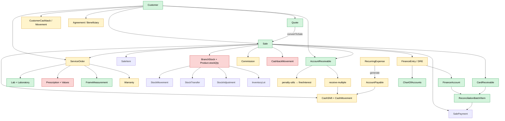

# 16 — Mapa de Dependências

> Fluxo de dependências entre módulos do PDV Ótica. Para cada seta: arquivos envolvidos, atomicidade, risco.

## 1. Diagrama macro

**Legenda:**
- 🟢 verde = integração clara, transacional ou idempotente por schema
- 🟡 amarelo = integração razoável mas com gaps (try/catch silencioso, sem unique, etc.)
- 🔴 vermelho = ponto de fragilidade conhecida

## 2. Setas críticas — análise

### 2.1 Quote → Sale (conversão)

| Item | Status |
|---|---|
| Arquivo principal | `services/quote.service.ts:735-908` |
| Atomicidade | `prisma.$transaction` ✅ |
| Idempotência | ✅ schema `Quote.convertedToSaleId @unique` |
| Risco se falhar no meio | venda parcial criada, fica em estado inconsistente |
| **Lacunas confirmadas** | **🔴** Não cria `AccountReceivable`, `CardReceivable`, `FinanceEntry`, `CashbackMovement` ganho (rel. 07 H1) |
| Classificação | 🔴 |

### 2.2 Sale → BranchStock

| Item | Status |
|---|---|
| Arquivo principal | `services/sale.service.ts:415` (`atomicStockDebit`) |
| Atomicidade | ✅ via `updateMany WHERE quantity >= solicitado` (race-safe) |
| Idempotência | parcial (transação rollback se falhar) |
| Risco se falhar no meio | Venda revertida ✅ |
| Caminhos divergentes | 🔴 `quote.convertToSale` decrementa só `Product.stockQty`, ignora `BranchStock` (rel. 09 J2) |
| 🔴 `refund` credita só `Product.stockQty` (rel. 09 J3) |
| Classificação | 🔴 (paths secundários) / 🟢 (path principal) |

### 2.3 Sale → CashShift / CashMovement

| Item | Status |
|---|---|
| Arquivo | `services/sale.service.ts:490` |
| Atomicidade | dentro da `$transaction` da venda ✅ |
| Auto-abertura | se `openShift` não existe, cria com `openingFloatAmount: 0` (linha 342) — 🟡 surpreende operador |
| Idempotência | OK (1 venda → N CashMovements determinísticos) |
| Quais métodos | `METHODS_IN_CASH = [CASH, PIX, DEBIT_CARD]` |
| Classificação | 🟡 |

### 2.4 Sale → AccountReceivable (STORE_CREDIT/BALANCE_DUE)

| Item | Status |
|---|---|
| Arquivo | `services/sale.service.ts:514-562` |
| Cria N parcelas com `calculateInstallments` ✅ |
| `validateCreditLimit` chamado antes — 🔴 mas é stub (rel. 13 N2) |
| Idempotência | ❌ schema sem `[saleId, installmentNumber] unique` (rel. 04 D7) |
| Atomic | ✅ dentro da $transaction |
| Caminho conversão Quote → Sale: ❌ NÃO cria (rel. 07 H1) |
| Classificação | 🔴 |

### 2.5 Sale → Commission

| Item | Status |
|---|---|
| Arquivo | `services/sale.service.ts:629-652` |
| Cálculo | `User.defaultCommissionPercent` ou 5% — 🟠 ignora `CommissionRule` (rel. 09 J9) |
| Atomic | ✅ dentro da $transaction |
| Status | PENDING (precisa aprovar depois) |
| Cancelamento de venda → CANCELED ✅ |
| Refund de venda → ⚠️ **NÃO cancela commission** (rel. 03 §4.3) |
| Classificação | 🟠 |

### 2.6 Sale → Cashback (ganho)

| Item | Status |
|---|---|
| Arquivo | `services/sale.service.ts:669-680` (`cashbackService.earnCashback`) |
| Atomic | 🔴 **fora da transação principal** |
| Idempotência | ⚪ depende da implementação do service |
| Risco se falhar | venda OK + cashback não creditado — recuperável manual |
| Classificação | 🟠 |

### 2.7 Sale → FinanceEntry (DRE)

| Item | Status |
|---|---|
| Arquivo | `services/sale.service.ts:655-661` (`generateSaleEntries(tx, ...)`) |
| Atomic | dentro da $transaction MAS try/catch silencioso (linha 658-661) |
| Idempotência | ✅ schema `FinanceEntry @@unique([companyId, sourceType, sourceId, type, side])` |
| Risco se falhar | venda OK + DRE quebrado — silencioso |
| Cancelamento → `deleteMany` por sourceType/sourceId ✅ |
| Conversão Quote → Sale: ❌ NÃO gera (rel. 07 H1) |
| Classificação | 🟠 |

### 2.8 RecurringExpense → AccountPayable (gerar contas do mês)

| Item | Status |
|---|---|
| Arquivo | `app/api/recurring-expenses/generate/route.ts` |
| Atomic | ❌ check + create fora de transação |
| Idempotência | ❌ schema sem unique de período (rel. 04 D8) |
| Risco | duplicação se chamado 2× concorrente |
| Classificação | 🟠 |

### 2.9 AccountReceivable → CashMovement (baixa)

| Item | Status |
|---|---|
| Arquivo | `app/api/accounts-receivable/receive-multiple/route.ts:121` |
| Atomic | ✅ dentro de `$transaction` |
| Idempotência | ✅ checa status RECEIVED/CANCELED antes (linha 75-87) |
| Vulnerabilidade | front pode passar `fineAmount/discountAmount` (rel. 03 §4.7) |
| Classificação | 🟠 |

### 2.10 StockTransfer → BranchStock (debit + credit)

| Item | Status |
|---|---|
| Arquivo (POST) | `app/api/stock-transfers/route.ts` |
| Arquivo (approve) | `app/api/stock-transfers/[id]/route.ts` |
| Atomic | ✅ dentro de `$transaction` |
| Race condition | 🟠 check de estoque fora da $transaction (rel. 09 J6) |
| Cross-branch validation | ✅ `branches.length !== 2 WHERE companyId` |
| Classificação | 🟠 |

### 2.11 OS → Sale (independência)

| Item | Status |
|---|---|
| Schema | `Sale.serviceOrderId @unique` — 1:1 quando vinculado |
| Status sincronia | 🟡 INDEPENDENTES (rel. 07 H10) — `Sale.status = COMPLETED` não força `OS.status = DELIVERED` |
| Mecanismo de sync | ⚪ não há trigger DB |
| Classificação | 🟡 |

### 2.12 OS → Lab → Garantia

| Item | Status |
|---|---|
| OS tem `laboratoryId` opcional |
| `Lab.defaultLeadTimeDays`, `urgentLeadTimeDays` |
| `Lab.apiKey` ⚠️ sem cifra (rel. 10 K11) |
| `Warranty` ligada a Sale ou OS via FKs |
| Classificação | 🟡 |

## 3. Acoplamento crítico (módulos que se conhecem demais)

### 3.1 `sale.service.ts` (1.205 linhas)
Conhece e modifica:
- `Sale`, `SaleItem`, `SalePayment`, `BranchStock`, `Product` (cache), `StockMovement`
- `CashShift`, `CashMovement`
- `AccountReceivable`, `CardReceivable`
- `Commission`
- `CustomerCashback`, `CashbackMovement`
- `FinanceEntry` (via finance-entry.service)
- `CompanySettings` (lê configs de juros/multa)

**🟠 God service.** 1.200+ linhas tocando 14 modelos. Refatoração natural: extrair sub-services (PaymentProcessor, CashbackProcessor, StockProcessor), mas o atual é coeso.

### 3.2 `quote.service.ts` (929 linhas)
Sub-paralelo do sale.service. Faz menos coisas (rel. 07 H1) — daí os gaps.

### 3.3 Conversão Quote → Sale e refund duplicam lógica de sale.service
Ambos deveriam **chamar `saleService.create`** (ou um helper compartilhado), em vez de re-implementar parcial. Por isso há divergência.

🔴 **Recomendação:** extrair `applySaleSideEffects(tx, sale, payments, items, ...)` reutilizável.

## 4. Pontos únicos de falha

### 4.1 `prisma.ts` singleton
Se Prisma quebrar, **todo o backend para**. Padrão Next.js — esperado.

### 4.2 `auth.ts` / `auth.config.ts`
Se NextAuth quebrar (ex: deploy mal feito), todos os logins param. **Beta v5** aumenta o risco.

### 4.3 `prisma-audit-middleware`
Se erro de gravação em `AuditLog` propagar, pode afetar requests. **Mitigação:** middleware usa `Promise.resolve().then(...)` para gravar em background (linha 51) ✅.

### 4.4 Supabase
Imagens de prescrição e logos no Supabase. Se Supabase cair:
- Upload de prescrição falha → não pode criar OS com imagem
- Visualização de logo quebra
- Sem fallback documentado

### 4.5 Anthropic API (OCR)
`/api/ocr/prescription` (presumido) usa `@anthropic-ai/sdk`. Se cair, OCR de prescrição falha. **Sem fallback** documentado.

### 4.6 `validateCreditLimit` (stub)
Se algum dia for implementado, vira ponto único de falha para vendas STORE_CREDIT.

## 5. Dependências externas

| Dep | Para | Risco |
|---|---|---|
| `@anthropic-ai/sdk` | OCR prescrição | 🟡 sem fallback |
| `@supabase/supabase-js` | Storage de imagens | 🟡 sem fallback |
| Vercel (hosting) | Tudo | 🟡 sem disaster recovery |
| Neon (Postgres) | Tudo | 🟠 sem backup strategy auditada |
| `next-auth ^5.0.0-beta.30` | Login user | 🟠 BETA |

## 6. Cascata de falhas

### Cenário A: Banco sobrecarregado
- Vendas em PDV travam (`prisma.$transaction` timeout)
- Sem queue de retry → operador refaz manualmente → pode duplicar venda

### Cenário B: Conexão admin Supabase expira
- Prescription image upload falha
- OS pode ser criada SEM imagem (campo opcional) — UX OK
- 🟡 OCR também falha

### Cenário C: Cookie corrompido (mesmo nome, valor inválido)
- Middleware permite passar (rel. 06 G4) → request chega no handler → `auth()` falha → 401
- Bypass parcial: usuário consegue fazer requisição (mas não autorizada). Risco: gateway → 401, mas DDoS em handler.

## 7. Achados consolidados

| # | Achado | Classe | Origem |
|---|---|---|---|
| P1 | `quote.convertToSale` é caminho duplicado e incompleto vs `sale.create` | 🔴 | rel. 07 H1 |
| P2 | `refund` é terceiro caminho que duplica/diverge de `sale.create` e `sale.cancel` | 🔴 | rel. 07 H3 |
| P3 | `sale.service` é God Service (1200+ linhas, 14 modelos) | 🟠 | grep |
| P4 | OS e Sale têm status independentes sem trigger | 🟡 | rel. 07 H10 |
| P5 | `RecurringExpense.generate` tem race condition e sem unique | 🟠 | rel. 08 I8 |
| P6 | Cashback e FinanceEntry chamados fora da transação principal da venda | 🟠 | rel. 07 H8/H9 |
| P7 | Pontos únicos de falha: NextAuth beta, Supabase, Anthropic — sem fallback documentado | 🟡 | grep |
| P8 | Lab.apiKey sem cifra | 🟠 | rel. 10 K11 |
| P9 | Sem disaster recovery / backup strategy auditável | 🟡 | grep |
| P10 | Cliente → Customer → Sale → AccountReceivable é fluxo coeso e bem feito ✅ | 🟢 | sale.service |
| P11 | StockMovement audit trail completo (PURCHASE/SALE/TRANSFER/ADJUSTMENT/etc.) ✅ | 🟢 | schema |
| P12 | FinanceEntry com unique de idempotência ✅ | 🟢 | schema D9 |
| P13 | Quote.convertedToSaleId @unique impede dupla conversão a nível DB ✅ | 🟢 | schema D10 |
